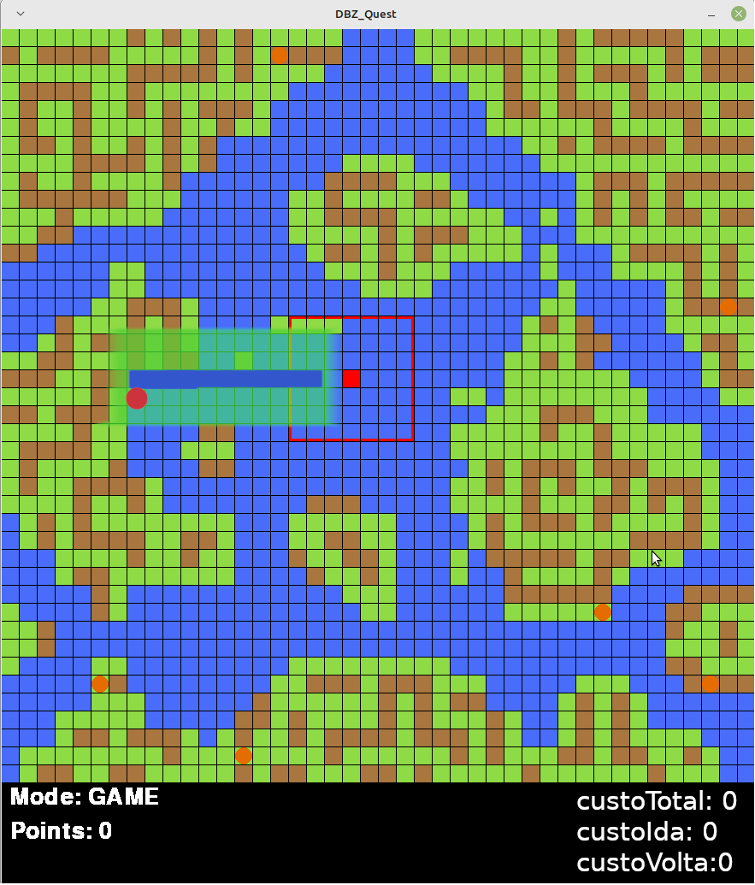

# DBZ Quest - Deployed

## Jogo desenvolvido para a materia de IA 

### Objetivo 
O jogador tera o objetivo de encontar utilizando seu radar, as 7 esferas e retornar para seu local inicial utilizando um algoritimo de busca heuristica (sera implementado o algoritimo A*) com o objetivo de menor custo de mobilidade
## Desenvolvido com:
    - Python 3.6.7
    - Pygame 2.2


## Sobre
A area do jogo composta  por 1764 quadrados em uma area de 42x42 tendo 3 variantes de blocos e seus custos:

Agua: + 10
Grama: + 1
Montanha: + 60

O Jogador possui uma area de alcance de seu radar de 42 blocos sendo eles distribuidos em 7x7 
A esfera sera indicada na visao da IA com o valor de 100

## Comandos
### Jogador:
#### SPACE = Inicia o player no mapa (Utilizar apos a edicao caso necessaria)
#### w - Movimena para cima
#### s - Movimenta para baixo
#### a - Movimenta para esquerda
#### d - Movimenta para direita

### Edicao de Mapa:
#### LCTRL + e - Retira o jogador do mapa
#### LCTRL + 1 - Seleciona elemento 1[Agua]
#### LCTRL + 2 - Seleciona elemento 2[Grama]
#### LCTRL + 3 - Seleciona elemento 3[Montanha]
#### LCTRL + s - Salva o arquivo

* .Os arquivos de mapa serao salvos por padrao em: data/map
	em formato .csv

* .Mapa principal salvo em: data/map/main


## Em construcao :construction:
- Melhorias e correcoes de bugs na interface
- Implementacao do Algoritimo A*


## Run
### Download 📥

```sh
git@github.com:Marquezv/DBZ_Quest.git
```
 - In the project folder
```sh
python3 -m virtualenv venv
source venv/bin/activate
pip install -r requirements.txt
python3 main.py
```

### Future UI and Utils


# DBZ Quest - Deployed

## Jogo desenvolvido para a materia de IA 

### Objetivo 
O jogador tera o objetivo de encontar utilizando seu radar, as 7 esferas e retornar para seu local inicial utilizando um algoritimo de busca heuristica (sera implementado o algoritimo A*) com o objetivo de menor custo de mobilidade
## Desenvolvido com:
    - Python 3.6.7
    - Pygame 2.2


## Sobre
A area do jogo composta  por 1764 quadrados em uma area de 42x42 tendo 3 variantes de blocos e seus custos:

Agua: + 10
Grama: + 1
Montanha: + 60

O Jogador possui uma area de alcance de seu radar de 42 blocos sendo eles distribuidos em 7x7 
A esfera sera indicada na visao da IA com o valor de 100

## Comandos
### Jogador:
#### SPACE = Inicia o player no mapa (Utilizar apos a edicao caso necessaria)
#### w - Movimena para cima
#### s - Movimenta para baixo
#### a - Movimenta para esquerda
#### d - Movimenta para direita

### Edicao de Mapa:
#### LCTRL + e - Retira o jogador do mapa
#### LCTRL + 1 - Seleciona elemento 1[Agua]
#### LCTRL + 2 - Seleciona elemento 2[Grama]
#### LCTRL + 3 - Seleciona elemento 3[Montanha]
#### LCTRL + s - Salva o arquivo

* .Os arquivos de mapa serao salvos por padrao em: data/map
	em formato .csv

* .Mapa principal salvo em: data/map/main


## Em construcao :construction:
- Melhorias e correcoes de bugs na interface
- Implementacao do Algoritimo A*


## Run
### Download 📥

```sh
git@github.com:Marquezv/DBZ_Quest.git
```
 - In the project folder
```sh
python3 -m virtualenv venv
source venv/bin/activate
pip install -r requirements.txt
python3 main.py
```

### Future UI and Utils


